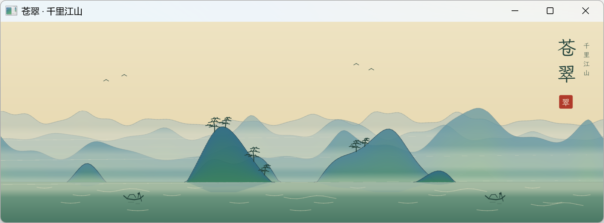

# CUI/苍翠：仓颉桌面 GUI 框架

用[仓颉编程语言](https://cangjie-lang.cn/)实现的跨平台/自渲染/声明式桌面 GUI 框架，提供声明式界面构建、状态管理、常用组件、文本渲染、矢量绘制以及系统能力集成等。底层依赖[仓颉 SDL 图形库](https://github.com/SunriseSummer/CangjieSDL)。




## 文档与示例

- [示例应用](examples/)
- [入门指南](docs/guide/index.md)
- [API 文档](docs/api/index.md)

## 开发环境

- Cangjie SDK 1.0.5
- Windows/Mac/Linux
- 参阅 [`CangjieSDL`](https://github.com/SunriseSummer/CangjieSDL) 项目文档，根据目标平台规格配置 SDL 和 SDL_ttf 动态库

> [!IMPORTANT]
>
> 发布和部署基于 CUI 的桌面软件时，请确保 SDL 和 SDL_ttf 动态库位于仓颉可执行文件目录，或在目标平台的动态库搜索路径中，即可以作为私有资产打包或在目标平台作为公共运行时安装。

## 快速开始

新建仓颉项目，在 `cjpm.toml` 配置 CUI 依赖：

```toml
[dependencies]
cui = { path = "<path/to/CangjieGUI>" }
```

在 `src/main.cj` 中编写代码创建一个简单窗口：

```cangjie
import cui.*

main() {
    let message = State<String>("你好，CUI")
    let app = DesktopApp(WindowSpec("CUI 示例", 640, 420))

    app.run {
        VStack {
            Panel {
                Label(message.value)
            }.flexible(false)
            Button("更新文本", {=> message.value = "状态已更新"})
                .role(ButtonRole.Primary)
                .width(160.vp)
        }.spacing(12.vp).padding(20.vp)
    }
}
```

执行 `cjpm run` 即可运行查看效果。

## 核心能力

- 基于 SDL3 实现自渲染 GUI 引擎。
- 基于仓颉尾随 lambda、extend、prop 等特性构建声明式 UI 编码范式。
- 提供 `VStack`、`HStack`、`ZStack`、`Grid`、`Panel`、`FlowRow`、`ScrollView`、`SplitView`、`Accordion`、动画折叠
  容器 `Reveal` 等布局容器，以及数据驱动、只渲染视口附近的懒加载容器 `LazyColumn`、`LazyRow`、`LazyList` 与 `LazyGrid`。
- 提供按钮、文本框、开关、复选框、单选框、选择器、步进器、滑块、进度条、环形进度、评分、状态徽标、过滤标签、
  步骤条、分页导航、面包屑、列表、数据表格、树视图、日期选择器、时间选择器、拖动重排列表、分段控件、标签页、下拉和组合框等控件。
- 提供下拉/右键菜单、应用菜单栏、选择器、提示、通知与模态对话框等浮层，浮层按栈管理、可嵌套，对话框内可继续打开下拉、组合框与右键菜单。
- 使用有顺序语义的链式修饰器配置尺寸、约束、内边距、表面、圆角、边框、阴影、渐变背景、弹性、可见性和可用性，支持 `.px`，`.vp`，`.fp` 尺寸单位表达。
- 以 `Observable`/`Bindable` 实现状态管理：可写 `State<T>`，带缓存的派生只读 `DerivedState`
  （`derive`/`map`），双向投影 `Binding`（`project`），控件按读写需要接受对应抽象。
- 以 `Keyed`、`rememberState`、`ForEach` 明确复杂嵌套树与列表中的局部状态身份，控件交互身份按构建顺序自动唯一。
- 支持主轴/交叉轴排列、权重布局、内容自适应、流式换行、裁剪滚动和可复用组件组合。
- 使用 GPU 几何图元和超采样渲染圆角、描边、图标、阴影及抗锯齿图形。
- 提供动画原语：物理弹簧 `Spring`、时长驱动可选缓动曲线与延迟的补间 `Animator`，以及永不静止的重复时间线 `Pulse`，
  由渲染循环充当动画时钟，脏帧下自动续帧；动画折叠容器 `Reveal` 以缓动高度做展开/收起过渡。
- 提供设计令牌尺度：间距 `Spacing`、圆角 `Radii`、动效 `Motion`，与颜色 `Theme`、字号 `FontSizes`、
  高度 `Shadow.elevation` 一起构成一致的设计系统。
- 提供文件对话框、消息框、剪贴板、光标、显示器、文件系统、时间、系统信息等平台能力接口。
- 已实现图元缓存、惰性渲染、脏帧检测/按需刷新等性能优化机制。

扩展阅读：[现代 GUI 核心范式洞察辨析：函数式/对象式，立即模式/保留模式](docs/modern-GUI-insights-and-analysis.md)

## 许可证

本项目以 [MIT 许可证](LICENSE) 发布。
