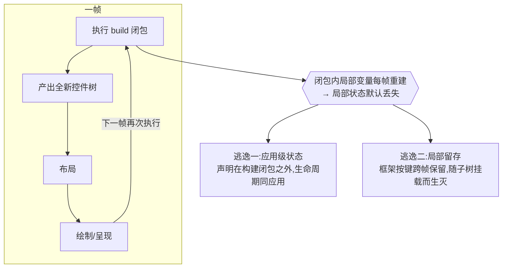
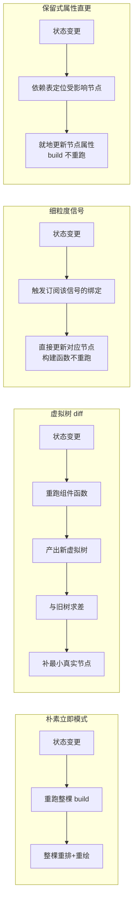
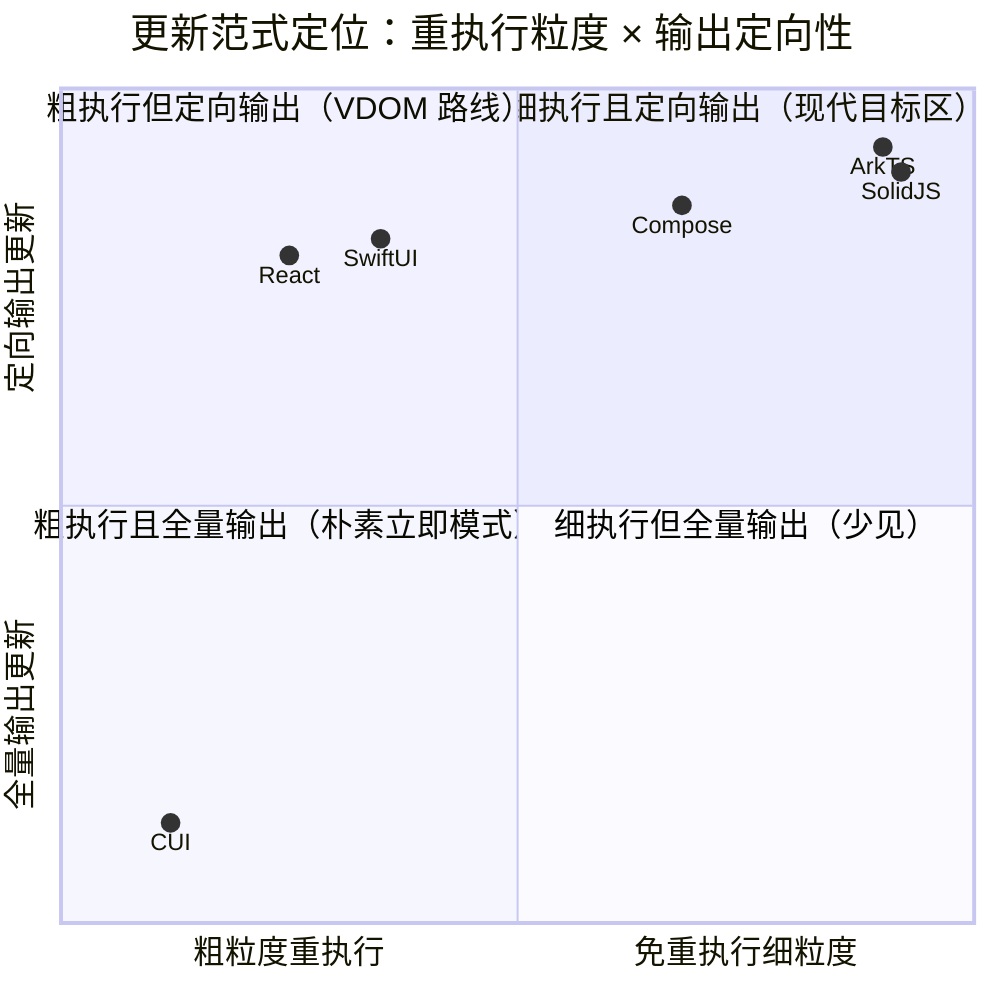
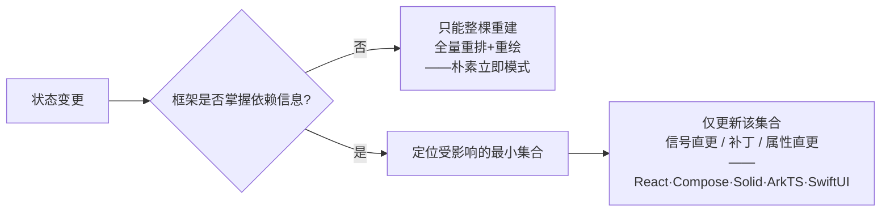
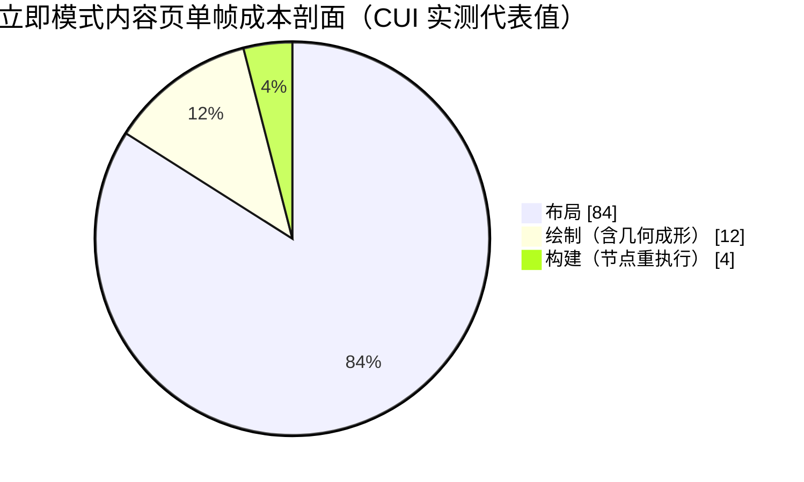

# 现代 GUI 核心技术洞察辨析

## 声明式框架的状态管理、依赖追踪与更新粒度

> 本文以综述与辨析为目的，梳理声明式 GUI 在“状态如何留存、变更如何传播、更新如何最小化”这一核心问题上的设计谱系，澄清一个流行却失真的论断——“基于函数的声明式实现在性能上不可能胜过保留式组件对象模型”。文中以一个立即模式桌面框架（仓颉 CUI）的实测数据作为案例支撑，论证的对象是设计范式本身，而非具体产品。

---

## 摘要

声明式 GUI 的性能与人体工学，长期被归因于两组对立：函数式对阵对象式、立即模式对阵保留模式。本文主张这两组对立都不是决定性的分水岭。真正决定“一次状态变更需做多少功”的，是**依赖追踪的粒度**——框架是否知道“哪个输出依赖哪个状态”。本文提出三条正交设计轴（节点生命周期、重执行粒度、输出更新粒度）作为分析框架，据此对 CUI、React、Jetpack Compose、SolidJS/Svelte、SwiftUI、ArkTS 六个代表进行横向定位；以 SolidJS 为反例，证明函数式实现可以取得与保留式属性直更同级、乃至更省的更新粒度。本文进一步用帧相成本剖面指出“重新执行 N 个节点很慢”这一直觉的成本项错置：节点重执行往往是最廉价的阶段，真实开销在布局与绘制。结论是：立即模式配合缓存与脏帧跳过，在“多数静止、偶发交互”的桌面工况下是一个站得住的甜区；而“大而密的树 + 高频局部更新”工况才真正需要细粒度更新，其引入路径（重组作用域或信号）仍然是函数式的，代价是依赖追踪机制与可跳过的保留式布局，而非退回对象生命周期。

**关键词**：声明式 UI；立即模式；保留模式；依赖追踪；细粒度响应式；重组；信号；脏帧跳过；增量计算

---

## 1 引言：声明式 GUI 的核心张力

声明式 UI 的共同前提是：开发者描述“界面在当前状态下应是什么样”，框架负责把描述变为像素，并在状态改变时让二者重新一致。这一前提立即引出一个张力：

- 描述是**每次都重新求值**的（一个构建函数、一段组合闭包）；
- 而界面状态（光标位置、滚动偏移、焦点、动画进度）必须**跨越多次求值而存活**。

如何在“反复重新描述”与“状态持续存活”之间取得平衡，并让“状态变了 → 界面最小化地跟上”，是所有声明式框架的核心工程，也是它们彼此分化的根源。围绕这一问题存在大量似是而非的经验判断，本文旨在为其建立一个可辨析的框架。

## 2 背景：每帧重建与局部状态的困境

在最朴素的声明式实现中，视图由一个构建闭包描述，该闭包在每次刷新时整体重新执行，产出一棵全新的控件树，随后布局、绘制。其直接后果是：**闭包内的局部变量在每次执行时都被重建**，因而无法承载需要跨帧存活的状态。

<b>图 1</b> 每帧重建循环与局部状态的两条逃逸路径

两条逃逸路径分别对应两类机制：其一是把状态**提升**到构建闭包之外，由应用自身持有（状态提升原则）；其二是由框架提供**按键留存**的局部状态（如 Compose 的 `remember`、React 的 `useState`、CUI 的 `rememberState`），它随子树的挂载而创建、随卸载而回收。后者之所以必要，正是因为直接写在闭包内的状态会被每帧重置。

值得强调：留存机制解决的是“存住”，与“变更如何传播”是两个问题。一个能跨帧存活但不可观察的值，并不会在其改变时触发界面更新；因此留存之外仍需**可观察状态原语**（可读、可写、变更可被监听）。二者的区分是后文诸多辨析的基础。

## 3 分析框架：三条正交的设计轴

本文主张，声明式 GUI 的更新行为应沿三条**彼此正交**的轴来刻画。混淆这三条轴，是“函数式必然更慢”一类论断的根源。

### 3.1 轴一：节点生命周期（立即 / 保留）

界面节点是每次求值都重建（立即模式，如 Dear ImGui 谱系），还是作为持久对象跨越更新、就地改属性（保留模式，如传统 DOM、ArkUI 渲染树）。

### 3.2 轴二：重执行粒度（状态变更时“跑多少代码”）

一次状态变更触发多少描述代码被重新执行：

- **粗粒度**：重跑整个构建函数（朴素立即模式，亦即 React 组件函数的重渲染）；
- **作用域级**：只重跑“读取了该状态”的子作用域（Compose 的重组作用域）；
- **零重执行**：构建函数只在初始化时跑一次，变更只驱动订阅该状态的那一个绑定（信号族）。

### 3.3 轴三：输出更新粒度（结果被改动多少）

重新求值后，界面输出被改动的范围：

- **全量**：整棵重排 + 重绘；
- **diff-补丁**：对比新旧描述，只补最小差异（虚拟树协调）；
- **直更**：变更值直接流向唯一相关节点的属性，无需比对（信号直更、状态→节点绑定）。

> **核心论点（一）**：三条轴正交。一个框架可以是“函数式语法（轴二可细）+ 立即或保留（轴一任选）+ 定向输出（轴三可细）”的任意组合。因此“函数 vs 对象”“立即 vs 保留”都不能单独决定更新代价，决定它的是**轴二与轴三能否做到细粒度**，而这取决于框架是否掌握依赖信息。

## 4 主流框架的横向对比

将六个代表沿上述三轴展开，可见“细粒度更新”由**不同机制**达成，横跨函数式与对象式、立即与保留：

| 框架 | 节点生命周期 | 状态变更时 build 是否重跑 | 输出更新粒度 | 达成细粒度的机制 |
|---|---|---|---|---|
| **朴素立即模式（CUI）** | 立即（整棵重建） | 是，整棵重跑 | 全量重排+重绘（以缓存与脏帧跳过缓解） | 无细粒度追踪，全局代际计数触发整树重建 |
| **React** | 保留（真实 DOM/Fiber） | 是，组件函数重跑 | diff-补丁（补最小真实节点） | 虚拟树协调（事后求差） |
| **Jetpack Compose** | 保留（槽表/布局树） | 作用域级（仅读该状态的重组作用域） | 跳过未变的可组合项 | 快照系统的读追踪 + 重组作用域 |
| **SolidJS / Svelte 5** | 保留 DOM（节点建一次） | 否，构建函数只跑一次 | 信号直更对应绑定 | 细粒度信号（事前建立的响应图） |
| **ArkTS（ArkUI）** | 保留（ArkUI 节点树） | 否（@State 变更不整体重跑 build） | 状态→节点属性直更 | 被观察属性到节点的依赖绑定 |
| **SwiftUI** | 值类型视图（短命重建） | body 重求值（粗），但 @State 按身份留存 | diff → 定向更新 | 结构身份键定的 @State + 依赖图 |

四种更新传播范式的对照如图 2：

<b>图 2</b> 四种更新传播范式：从整棵重跑到定向直更

将六者投影到“重执行粒度 × 输出定向性”平面，其分布如图 3。关键观察是：**SolidJS/Svelte（函数式、非重跑）与 ArkTS（对象式、属性直更）落在同一象限**——二者更新代价同级，而语法范式相反。

<b>图 3</b> 框架定位：细粒度不属于某一种语法范式

## 5 核心论点：依赖追踪才是分水岭

图 3 中，唯一位于左下（粗执行、全量输出）的是朴素立即模式；其余五者虽机制各异，却都进入了“定向输出”区。它们的共同点不是“用对象”，也不是“保留”，而是**都掌握某种形式的依赖信息**：

- 虚拟树协调用**事后求差**推断变更范围；
- 重组作用域与信号用**事前读追踪**登记依赖；
- 保留式属性直更把依赖固化为**状态到节点的绑定**。

> **核心论点（二）**：细粒度更新是**依赖追踪**的产物，与“节点是否为保留对象”正交。ArkTS 的细粒度来自“@State 记录了哪个节点读它”——这是依赖追踪，只是附着在保留节点上；SolidJS 用信号取得**完全相同**的细粒度，却没有任何保留的组件对象。因此保留式组件对象对细粒度而言**充分但非必要**。

<b>图 4</b> 有无依赖追踪，决定“全量重建”与“定向更新”的分野

由此，“基于函数的实现做不到先进的状态与更新”是一个**范畴错误**：它把“函数式语法”与“每帧整体重跑且无依赖追踪”错误地等同。SolidJS 与 Svelte 5 是直接反例——它们是彻底的函数/编译式，组件函数只求值一次，状态变更只驱动订阅的绑定，既无整体重跑，也无虚拟树求差；在公开的 js-framework-benchmark 中，信号族长期位居前列，普遍快于虚拟树方案，并与最快的保留式实现同档。这从经验上否证了“函数式不可能更快”。

一个佐证行业方向的事实是：React 与 Compose 都从“保留式类组件”演化到“函数 + 留存/钩子”；SwiftUI 表面是带字段的结构体，但其 `@State` 存储由框架按结构身份在外部托管，本质是“按身份 remember”的语法糖。换言之，函数 + 留存（即 `rememberState` 一类）是现代主流的**落点**，而非其落后于保留式对象的证据。

## 6 性能辨析：“重新执行 N 个节点很慢”的谬误

一个常见论证是：某组件含 50 个节点，一处数据改动只影响其一；函数式重跑整个函数，则 50 个节点全部重执行，而保留式只更新 1 个节点，故函数式“理论上不可能更快”。此论证对朴素立即模式成立，但其一般化结论有两处需要澄清。

### 6.1 范畴层面：该批评针对“无追踪的整体重跑”，非“函数式”

如第 5 节所述，函数式并不蕴含“整体重跑”。信号族在函数式语法下即可做到“只更新那 1 个节点”。因此该论证至多说明“朴素立即模式在定向小改上不占优”，不能推广到函数式整体。

### 6.2 成本层面：节点重执行常常是最廉价的阶段

更根本的问题是**成本项错置**。以 CUI 的实测帧相剖面为例（内容页，代表值）：节点重执行所在的**构建阶段仅占单帧约 3–6%**；真正的开销在**布局**（约束求解，含文本度量）与**绘制**（含 CPU 几何成形）。

<b>图 5</b> “重执行 50 个节点”打在最廉价的阶段上

据此，“重新执行 50 个节点构造”不过是几十次廉价的结构分配与登记，微秒量级；把它当作性能靶子，打的是帧成本里最不疼的地方。

但这不意味该批评毫无价值——**将其搬到正确的成本项上，反而更有力**：朴素立即模式一次状态变更不只重跑构建，还会**重排整棵、重绘整棵**（即那 90%+）。保留式属性直更则免去整棵布局与绘制，只触碰约一个节点。因此真实差距是“一次定向小改，立即模式付出一整帧的布局与绘制，而保留式付出约一个节点的更新”，它在**大而密的树 + 高频局部改动**工况下确实显著。批评的方向正确，只是该说“省掉的是无关子树的布局与绘制”，而非“省掉节点重执行”。

### 6.3 立即模式的可行性与保留式的隐性成本

“重发全部内容”是否可行，取决于**单节点成本**。当每节点成本足够低，并叠加跨帧缓存（几何网格、成形文本、度量结果）与脏帧跳过时，整棵重发是可行且高吞吐的——游戏 UI 与 Dear ImGui 每帧重发全部内容仍达到 120fps，即为明证。反过来，保留式并非没有账单：属性观察机制、依赖图与协调器的簿记、常驻整棵节点树的内存，以及指针追逐式对象图对 CPU 缓存的不友好。立即模式则是数据导向、少分配、缓存友好的。

> **核心论点（三）**：性能天花板取决于**工况**，而非“立即对保留”的抽象优劣。SolidJS（非保留、函数式）位居基准前列，恰说明保留对象不是高性能的前提。

## 7 保留式组件对象模型：去掉了什么、保留了什么、新增了什么

回到“把 UI 声明放进带 `build()` 的自定义类型、状态作为成员字段”这一具体设想（ArkTS `@Component struct` 即此）。它对开发体验的影响可精确拆解：

| | 保留式组件对象模型 |
|---|---|
| **消失** | 显式的按键留存仪式（`rememberState("key")`）——成员字段随实例天然跨帧存活 |
| **仍需** | ① 可观察状态原语：字段须是 `@State`/信号，因为“持久 ≠ 变更会触发更新”。② 列表/重复/条件子树的**协调键**（如 `ForEach` 的 keyGenerator）——身份问题从“留存键”迁移为“实例协调键”，并未消失 |
| **新增** | **实例生命周期 + 协调引擎**：框架须在每次更新把“本次声明的组件”对上“上次留存的实例”，立即模式因此变为保留模式 |

由此可见，保留式对象**去掉的是可见的留存调用，而非留存本身，更非身份/协调**；它以引入协调器为代价换取局部状态的书写便利。考虑到 React、Compose 均从类组件退回“函数 + 钩子/remember”以规避实例生命周期，而 SwiftUI 的 `@State` 实为“按身份 remember”的糖，可以判断：**这是一次范式取舍，而非能力升级**。

一条务实的折中路线是：把“组件对象”实现为“按键留存 + 稳定身份作用域”之上的**语法糖**——字段声明在底层展开为当前身份作用域下的留存状态。如此可获得“状态即字段、无可见留存调用”的体验，却不引入协调器与实例生命周期，引擎仍为立即模式。这大概率是“仅为改善人体工学”时性价比最高的落点。

## 8 案例研究：一个立即模式桌面框架的定位与前沿

以 CUI 为例说明立即模式框架在真实工程中的位置与优化前沿。

**现状**：立即模式（Dear ImGui 的 ID 栈谱系），身份由“构建序 + 作用域路径”派生；响应式为粗粒度的全局写代际计数，任一状态写入触发整树重建。既有缓解手段：三级跨帧缓存（几何、成形文本、度量）将重复提交降为查表；**脏帧跳过**在无输入、无状态变更、无连续动画时跳过整帧的构建/布局/绘制，使空闲帧成本归零。

**甜区**：多数时间静止、偶发交互的桌面应用。空闲由脏帧跳过清零；活动帧虽为整棵重建，但单帧成本被缓存压低，体验流畅且引擎极简——无协调器、无实例生命周期、控制流（`if`/`for`/函数）在构建块中天然可用。

**弱区**：大而密的树 + 高频局部改动。此时每次小改仍付出一整帧的布局与绘制，与保留式属性直更相比存在真实且可观的差距（见 6.2）。

**优化前沿**：关键杠杆**不在“少重跑构建”**（构建仅占 3–6%），而在“让无关子树的布局与绘制可被跳过”，即**可跳过的保留式子布局**。一个实测佐证是：在全量重建循环下，度量记忆化命中率为零（布局约束在重建间不一致），唯有“保留子树”级别的缓存才有价值。因此细粒度化对该框架的收益，取决于能否把布局与绘制做成按子树可跳过，而非替换响应式语法。引入细粒度的两条路径仍是函数式的：

- **重组作用域**（Compose 式）：登记哪个构建作用域读了哪个状态，只重跑受影响作用域并跳过未变者；
- **信号**（Solid 式，接近自调整计算）：绑定订阅信号，变更只驱动该绑定。

二者都保持函数式语法，代价都是依赖追踪机制，且对该框架的真实收益都**受制于**可跳过的保留式布局/绘制——后者才是破坏性的核心工作。

## 9 设计决策框架

综合前述，给出面向工况的选型判断，而非抽象优劣排序：

| 工况特征 | 推荐范式 | 依据 |
|---|---|---|
| 多数静止、偶发交互（多数桌面工具） | 立即模式 + 跨帧缓存 + 脏帧跳过 | 空闲归零、活动帧廉价、引擎最简，无协调器负担 |
| 中等动态、局部频繁但树不大 | 立即模式 + 局部保留式子布局 | 以最小改动跳过热点子树的布局/绘制 |
| 大而密的树 + 高频局部更新（仪表盘、实时列表） | 细粒度响应式（信号或重组作用域）+ 可跳过保留式布局 | 定向更新省下整棵布局/绘制 |
| 仅需改善局部状态书写，不改引擎 | 立即模式 + “组件对象”语法糖（留存之上） | 得体验而不引入实例生命周期 |
| 极高频、海量节点、跨平台保留树 | 保留式 + 状态→节点直更（ArkTS 式） | 属性直更省去重建，天花板高但引擎复杂 |

选型的实践准则是：**先量化目标工况的帧相成本，再决定是否为其引入依赖追踪**。在节点重执行本就廉价、空闲已被跳过的前提下，盲目引入细粒度机制可能只增加复杂度而不改善实测。

## 10 结论

本文的核心结论有三：

1. **分水岭是依赖追踪的粒度，而非“函数 vs 对象”或“立即 vs 保留”**。三条设计轴正交，细粒度更新是依赖信息（事前读追踪、事后求差或固化绑定）的产物。
2. **函数式可达最先进的更新粒度**。SolidJS/Svelte 以函数式语法取得与保留式属性直更同级、乃至更省的更新，并在经验基准中领先；“函数式不可能更快”是范畴错误。
3. **性能须按成本项与工况判断**。节点重执行常是最廉价的阶段，朴素立即模式的真实代价在无关子树的布局与绘制；立即模式配合缓存与脏帧跳过在桌面工况下是站得住的甜区，而大树高频局部更新才需要细粒度，其引入路径依旧是函数式的，代价在依赖追踪与可跳过的保留式布局。

因此，“引入保留式组件对象”与“引入细粒度响应式”是两个可分离的决策：前者主要改变书写范式并引入协调器，后者才改变更新代价；而后者无须以前者为前提。对以桌面为主要目标的立即模式框架而言，更稳妥的演进不是退回对象生命周期，而是在保持函数式与立即模式内核的同时，按实测工况按需引入依赖追踪与可跳过的保留式布局。

---

## 参考文献

1. Omar Cornut. *Dear ImGui — FAQ: About the ID Stack System.* 立即模式 GUI 以作用域 ID 栈维持跨帧控件身份。https://github.com/ocornut/imgui/blob/master/docs/FAQ.md
2. Android Developers. *Thinking in Compose / State and Jetpack Compose / derivedStateOf.* 重组、快照状态与按需失效的派生状态。https://developer.android.com/develop/ui/compose/mental-model
3. SolidJS Documentation. *Reactivity: Signals, Effects, createMemo.* 细粒度响应式与信号驱动的定向更新。https://docs.solidjs.com/concepts/reactivity
4. Svelte Documentation. *Runes.* 编译期信号与细粒度响应。https://svelte.dev/docs/svelte/what-are-runes
5. React Documentation. *useState / Preserving and Resetting State.* 函数组件的状态钩子与协调中的状态保留语义。https://react.dev/reference/react/useState ; https://react.dev/learn/preserving-and-resetting-state
6. Apple Developer Documentation. *SwiftUI — State and Data Flow / Binding.* 结构身份键定的状态存储与双向绑定。https://developer.apple.com/documentation/swiftui/state-and-data-flow
7. Vue.js Guide. *Reactivity in Depth.* 基于依赖收集的响应式系统。https://vuejs.org/guide/extras/reactivity-in-depth.html
8. HarmonyOS ArkUI. *ArkTS 状态管理概述.* 保留式声明 UI 与 @State 到节点的最小更新。https://developer.huawei.com/consumer/cn/doc/harmonyos-guides/arkts-state-management-overview
9. U. A. Acar, G. E. Blelloch, R. Harper, et al. *A Consistent Semantics of Self-Adjusting Computation.* 依赖追踪下变化传播的一致性语义。https://arxiv.org/abs/1106.0478
10. E. Czaplicki. *Elm: Concurrent FRP for Functional GUIs.* 函数式 GUI 中显式状态与消息驱动视图的理论背景。https://elm-lang.org/assets/papers/concurrent-frp.pdf
11. S. Krause. *js-framework-benchmark.* 前端框架更新性能的公开对比基准。https://github.com/krausest/js-framework-benchmark

---

<i>本文由一次关于声明式 GUI 状态模型的设计研讨整理而成；CUI 的实测数据用作立即模式的案例支撑，不构成对任一框架的优劣判定。</i>

