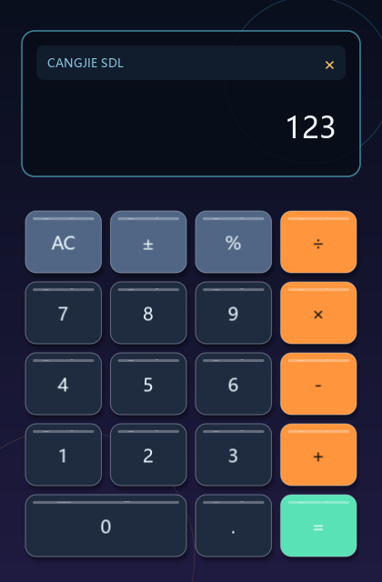

# 计算器示例教学

一个 420×640 固定尺寸的四则运算计算器，覆盖图形应用最常见的三类需求：**指针命中测试**、
**键盘文本输入**和**自定义控件绘制**。建议先运行起来，再对照本文阅读源码。



## 运行

```powershell
cjpm build
cjpm run
```

运行时需要 `SDL3.dll` 与 `SDL3_ttf.dll`，部署方式见 [示例总览](../README.md#运行时动态库)。

操作方式：

- 鼠标左键点击按键。
- 键盘直接输入：`0-9`、`.`、`+`、`-`、`*`、`/`、`%`、`=`；`Enter` 等于 `=`，
  `Backspace` 逐位删除，`Esc` 退出。

## 项目结构

| 文件 | 职责 |
|---|---|
| `src/main.cj` | 装配入口：创建窗口，进入主循环 |
| `src/state.cj` | 布局常量、按键网格、`CalcState` 状态类 |
| `src/logic.cj` | 计算逻辑：按键分发、四则运算、显示格式化 |
| `src/loop.cj` | 事件循环：鼠标命中、键盘映射 |
| `src/render.cj` | 渲染：背景、显示面板、按键 |
| `src/theme.cj` | 调色板 |

结构上刻意做了三层分离：**logic 不依赖 sdl**（纯状态变换，可单独测试），loop 把事件翻译成
逻辑调用，render 只读状态绘制画面。

## 入口与资源生命周期

```cangjie
main(): Int64 {
    try (window = SdlWindow(WindowSpec(View.TITLE, View.WIDTH, View.HEIGHT, resizable: false))) {
        runCalculator(window)
    }
    return 0
}
```

`SdlWindow` 实现 `Resource`，用 try-with-resources 管理，任何退出路径（包括异常）都会关闭
窗口并释放渲染器。布局是绝对坐标，所以窗口设为不可调整大小；需要自适应布局时改为
`resizable: true` 并响应 `UiEvent.WindowResized`。

## 状态建模

`state.cj` 中的常量全部收拢进语义类型：`View`（窗口）、`Panel`（显示面板）、`Pad`（按键网格）。
按键由 `buttonRect(col, row, span)` 从网格坐标换算矩形，`"0"` 键 `span = 2` 占两列——增删按键
只需改 `buildButtons` 里的一行。

`CalcState` 是典型的"标准计算器"状态机：

- `display`：当前读数文本（唯一的输入缓冲）。
- `stored` + `pending`：已存左操作数与待执行运算，`pending: ?CalcOp` 用 `Option` 表达
  "尚未选择运算符"。
- `shouldResetDisplay`：按过运算符后，下一个数字键开始新数而不是追加。
- `hasError`：除零后进入错误态，任何输入先清盘再生效。

## 事件循环

```cangjie
while (state.isRunning) {
    var event = window.pollEvent()
    while (let Some(e) <- event) {
        handleEvent(state, e)
        event = window.pollEvent()
    }
    draw(window.renderer, state)
    window.delay(View.FRAME_DELAY_MS)
}
```

每帧先把事件队列取空（`pollEvent` 返回 `None` 为止），再整体重绘。垂直同步默认开启，
`present` 会对齐显示器刷新，`delay(8)` 进一步降低空转占用。

两条输入路径都翻译成同一个 `press(state, label)` 调用：

- **鼠标**：`UiEvent.MouseDown(MouseButton.Left, x, y)` 事件坐标就是逻辑坐标，逐个按键做
  `rect.contains(x, y)` 命中测试。
- **键盘**：字符类输入不匹配 `KeyDown` 扫描码，而是监听 `UiEvent.TextInput`——窗口创建时
  已自动开启文本输入，系统处理好修饰键与键盘布局后交付字符串，示例只需按 `Rune` 映射到
  按键标签（`*` 与 `x` 都映射到 `×`）。`Enter`、`Backspace`、`Esc` 这类控制键仍走 `KeyDown`。

## 渲染

每帧固定四步：

```cangjie
renderer.beginScene(View.WIDTH_F, View.HEIGHT_F, Pal.BG)   // 清屏 + 进入超采样目标
// ...全部绘制调用...
renderer.endScene()                                        // 解析回窗口（抗锯齿在此发生）
renderer.present()
```

值得对照源码看的几个点：

- **圆角与描边**：面板与按键用 `fillRoundedRect` 打底、`strokeRoundedRect` + `Pen` 描边，
  代替旧式直角 `fill` + `rect`。
- **软阴影**：按键投影用 `fillRoundedRectSoft(..., feather: 6.0)`，边缘按羽化像素渐隐，
  一次调用得到无带状伪影的阴影。
- **文字排版**：TTF 文字按 `pointSize` 指定字号（`FontSizes` 提供标准档位）。渲染器没有
  右对齐接口，`drawTextRight` 用 `textWidth` 度量后左移绘制；读数超宽时降字号——这就是
  "度量驱动排版"的最小示例。按键标签直接 `textCenter(label, rect, ...)` 在矩形内居中。
- **背景渐变**：横条带逐行插值颜色近似垂直渐变，简单且够用。

## 练习建议

1. 给按键加按下反馈：记录 `MouseDown`/`MouseUp`，按下时把按键矩形 `shift(0.0, 2.0)` 再绘制。
2. 支持连按 `=` 重复上一次运算（记录最后一次操作数）。
3. 把 `logic.cj` 抽出单元测试：`press` 序列驱动 `CalcState`，断言 `display`。
