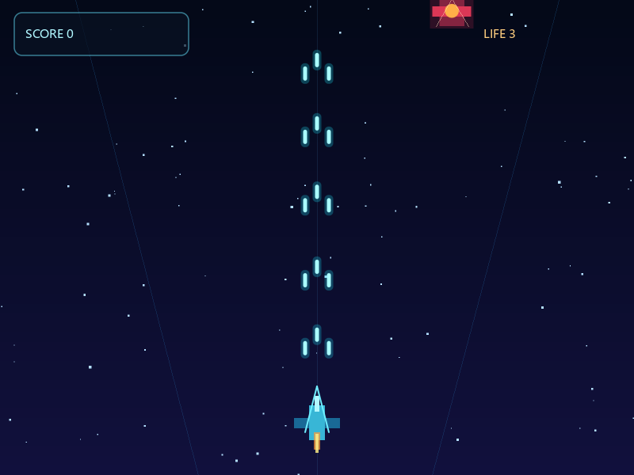

# 雷霆战机示例教学

一个 800×600 的纵版射击小游戏：操纵战机躲避下压的敌机并将其击毁，敌机漏防或撞机扣命，
三条命耗尽后按空格重开。示例覆盖实时游戏的核心骨架：**基于时间步长的帧循环**、
**按键持续状态**、**实体集合更新**、**AABB 碰撞**与**粒子特效**。



## 运行

```powershell
cjpm build
cjpm run
```

运行时需要 `SDL3.dll` 与 `SDL3_ttf.dll`，部署方式见 [示例总览](../README.md#运行时动态库)。

操作方式：

- 方向键移动；按住空格开火（开火时移速降低，便于精确走位）。
- 游戏结束后按空格重新开始，`Esc` 退出。

## 项目结构

| 文件 | 职责 |
|---|---|
| `src/main.cj` | 装配入口：创建窗口，进入游戏循环 |
| `src/config.cj` | 全部调参常量：舞台、战机、子弹、敌机、粒子、HUD |
| `src/model.cj` | 实体类型与 `GameState`、重开逻辑 |
| `src/loop.cj` | 帧循环与输入事件 |
| `src/systems.cj` | 逐帧更新：星空、战机、子弹、敌机、粒子 |
| `src/collision.cj` | 碰撞判定与命数结算 |
| `src/render.cj` | 渲染：背景、实体、HUD、结算界面 |
| `src/theme.cj` | 调色板 |
| `src/util.cj` | 随机区间、矩形外扩与 AABB 相交等小工具 |

`config.cj` 把全部数值集中为语义常量（`Ship.FIRE_COOLDOWN`、`Foe.SPAWN_INTERVAL`……），
调手感只需改这一个文件，这是小游戏最值得沿用的习惯。

## 帧循环与时间步长

```cangjie
while (state.isRunning) {
    let now = window.ticks()
    let dt = clampF32(Float32(now - lastTicks) / Stage.MS_PER_SECOND, 0.0, Stage.MAX_DELTA)
    lastTicks = now

    handleEvents(window, state)
    update(state, dt)
    draw(window.renderer, state)
    window.delay(Stage.FRAME_DELAY_MS)
}
```

所有运动量都以"单位/秒"定义，每帧乘以 `dt`（秒），因此逻辑速度与实际帧率解耦——垂直同步
下 60Hz 与 144Hz 的手感一致。`dt` 上限截断到 `MAX_DELTA`（50ms）：拖动窗口、断点调试造成
的长停顿不会让实体瞬移穿越碰撞检测。

## 输入：事件转持续状态

按键事件是**边沿**（按下/抬起瞬间），而移动需要**电平**（是否按住）。`InputState` 做这层
转换：`KeyDown`/`KeyUp` 事件只翻转 `isLeftHeld` 等布尔量，`updatePlayer` 每帧读取它们积分
位移。开火同理——`isFireHeld` 配合 `cooldown` 计时器实现按住连发。

## 实体更新与集合维护

子弹、敌机、粒子都存放在 `ArrayList` 中，更新时**倒序遍历**，命中或越界即
`remove(at: i)`——倒序保证删除不影响尚未访问的下标。

敌机的两条轨迹逻辑值得一看（`systems.cj`）：

- `wobble(y)`：以纵坐标为相位的正弦横移，敌机呈蛇形下压，比直线下落更有压迫感。
- `nextSpawnDelay(score)`：刷新间隔随分数线性收紧并夹在下限之上，构成难度曲线。

## 碰撞与结算

`collision.cj` 用最朴素的 AABB 相交测试（`util.cj` 中的 `intersects`）。两个细节：

- 玩家受击框 `Player.bounds()` 比机身小一圈，视觉擦弹不判死，手感更公平。
- 受击/重生后有无敌时间，渲染层按固定频率闪烁提示（`isBlinking`），这是"状态在逻辑层、
  表现在渲染层"的典型分工。

爆炸是一次性生成 N 个带初速与重力的方块粒子（`burst`），寿命结束移除，透明度随剩余寿命
线性衰减。

## 渲染分层

`draw` 按"远→近"次序绘制：天空渐变条带 → 透视网格线 → 星空 → 子弹 → 敌机 → 战机 →
粒子 → HUD。全部夹在 `beginScene`/`endScene` 之间，斜线与圆角由超采样统一抗锯齿。

迁移到当前 `sdl` 模块后启用的新能力：

- 子弹与光晕用 `fillRoundedRect`（圆头弹更柔和），光晕矩形由 `grown` 外扩得到。
- 战机斜边用 `strokeLine` + `Pen(width: 2.0)`，粗描边圆头连接，取代 1px 硬边线。
- HUD 与结算面板用 `fillRoundedRect` + `strokeRoundedRect`；结算文字用
  `textCenter(text, rect, ...)` 在面板内精确居中，不再手对坐标。
- 计分文字是 SDL3_ttf 矢量字体（`pointSize: FontSizes.BODY`）。

## 练习建议

1. 新增敌机种类：给 `Enemy` 加 `hp > 1` 的重型机，命中后闪白、掉落加分道具。
2. 把星空改成多层视差：近层快、远层慢，各层不同亮度。
3. 用 `sdl.system.PerformanceClock` 统计帧耗时，在 HUD 显示 FPS。
4. 给开火加音效钩子（SDL3 音频未封装前，可先在开火处计数验证触发时机）。
